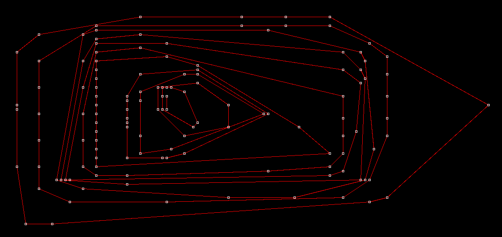

## Finding the perimeter 'most outside' a set of points. (Python)



Early into my programming hobby I was introduced to something called the travelling salesman problem - find the shortest path in a set of points which reaches all points and returns where it started. It wasn't long after reading something along the lines of "the only known method to find the shortest route everytime is guess and check," to become fascinated with the problem and attempt to come up with algorithms to solve it efficiently.

Iterating on an earlier idea whose JSbin format was lost to an OS reinstall, and becoming more of a programming exercise than anything else, I had the idea after watching 3Blue1Brown's <a href="https://www.youtube.com/watch?v=M64HUIJFTZM">video</a> on rotating lines and intersecting points that a good place to start would be to determine from the set of points "the most 'outside' perimeter" - or the perimeter determined by choosing one point, then rotating a line around that first point until it intersects with another one, then repeating until the set is enclosed (with the initial point being on some linear extreme of the set).

In practice, this turned out to be more difficult to implement than expected, and has set a personal record for most edge cases dealt with, but it does work, and this post will be going over some of the details and challenges.

```py
import math
import draw as d

print('---------------------start-----------------------')
```
`minVert()` will take the list of tuples representing the two dimensional points and find the pair the minimum vertical value. This behavior is assumed by the main function, so it isn't as modular as it could be considering the possible desire to experiment with starting values. 

Note that the grid's origin is located at the top left corner, mainly so you can appreciate the damage to my sanity that dealing with multiple edge cases and directed radians in a non standard orientation may have done.

```py
def minVert(li): #given list of point pairs, finds pair with smallest first value
	bottom = -float('inf')
	floor = []
	for i in li:
		if (i[1] == bottom):
			floor.append(i)
		elif (i[1] > bottom):
			floor = [i]
			bottom = i[1]
	result = max(floor, key=lambda x: x[0])
	return result
```
This is where the edge cases begin. The rotating line's orientation is measured in radians, but it is also crucial that it maintains its direction throughout its rotation. This means that for points `a` and `b`, *order matter.* This function doesn't just get the radian value between `a` and `b`, it gets the value from `a` to `b`.

```py
def get_radian(a, b): #find radian value between two points from 0 to 2*pi
	if   (b[0] == a[0] and b[1] > a[1]):
		return math.pi / 2
	elif (b[0] == a[0] and b[1] < a[1]):
		return (3 * math.pi) / 2
	elif (b == a):
		return print("GET RADIAN BETWEEN SAME TWO POINTS", a, b)

	atan = math.atan((b[1] - a[1]) / (b[0] - a[0]))
	if   (a[0] > b[0]):
		return math.pi + atan
	else:
		if (atan < 0):
			return 2* math.pi + atan
		else:
			return atan

```
Just dealing with some division by zero edge cases.
```py
def get_distance(a, b):
	if (a[0] == b[0]):
		return abs(a[1] - b[1])
	if (a[1] == b[1]):
		return abs(a[0] - b[0])
	c = (a[1] - b[1]) **2
	d = (a[0] - b[0]) **2
	return math.sqrt( c + d )

data = d.data
data = d.flipVert(data)
data = d.padding(data, 4)
data = d.scalar(data, 10)
d.setup(data, 1)
```
The `wrap` class (unconventionally lowercase) is the meat of this algorithm. Interpreted functionally, the class is initiliazed with all `points` in the data, and `exclusions`, points which may have already been connected and determines which to remove, and produces in its `border` attribute the set of points, in order, which form the 'most outside perimeter.'

```py
class wrap:
	def __init__(self, points, exclusions=[]):
		points = points
		points = [point for point in points if (point not in exclusions)]

		self.available_points = points

		self.border = [minVert(points)] #starts with most extreme x coord
		self.exclude = exclusions
		self.radian = 0
		
	def remove_points(self, x):
		self.exclude.append(x)
		self.available_points.remove(x)

```
`next_point()` is where it all goes down. `self.radian` was initialized as `0`, since the starting point is a lowermost point. This means at worst the first connection is completely level but never convex in the context of the final border.

`candidate_radian` is initialized at the max possible value, remember that since the rotation has to maintain its direction that in this sense pi over two and zero are being considered as two ends of a spectrum. `candidate_radian` is used to keep track of a radian from a given point which is larger than `start_radian` but as small as possible otherwise, ensuring that any points intersected while rotating the line are immediately adopted as the new pivot.

The `candidates` dictionary helps with another crucial edge case which might be easy to overlook. What happens when two or more points share the same radian, and that radian is the smallest possible (meaning it determines the next point). The answer here is that each point in the dict is associated with its distance from the pivot point, and if the dict remains unreset by a smaller radian remaining in the unchecked list, then each point is connected in order of distance as a straight line.

The central data structure to be aware of here is the dictionary of points with the `key` being the `dist`ance from the `start_point` and the `value` being the `point`. This allows for multiple points with the same angle from the `start_point` to be sorted by distance and connected in order.

To generalize the code, all candidates singular or in multiplicity are piped through the dictionary.

```py

	def next_point(self):
		start_radian = self.radian     #radian of last two connected points
		candidate_radian = math.pi * 2 #shrink from max possible radian value
		radian = None				   #defined by points tested in loop below
		start_point = self.border[-1]  #work outwards from last connected point
		candidates = {}				   #sorted in dict in case multiple radians are equal


		# "Find the smallest radian that's larger than the start radian" **
		for point in self.available_points:

			if (point in self.exclude or point == start_point):#or point == start_point):
				continue
			else:
				radian = get_radian(point, start_point)

			try:
				radian >= start_radian
			except:
				print('error')
				print('radian: ', radian, ' :: Abs rad: ', start_radian)
				print('point: ', point, ' :: start_point: ', start_point)

			#**radian must be less/equal than cand but greater/equal than start
			if (radian == candidate_radian):
				dist = get_distance(start_point, point)
				candidates[dist] = point #finding a radian equal to current -
				#- candidate adds to a dict that becomes a straight line of points.
				# These points get sorted below and before being connected.

			# If the radian is in fact greater than the start, but lesser than -
			# - all other candidates so far.
			if (radian >= start_radian and radian < candidate_radian): 
				dist = get_distance(point, start_point)
				candidates = {} #finding a radian closer to abs radian -
				#- than current candidate resets dict to single new candidate.
				candidates[dist] = point
				candidate_radian = radian #next cand radian must be smaller than this

		candidates = {key:candidates[key] for key in sorted(candidates)}
		#in case the dict does contain more than one point:
		#we sort it by their distance from the start point before connecting them.

		
		for distance in candidates: #add points in dict to border and exclude lists.
			self.border.append(candidates[distance])
			self.exclude.append(candidates[distance])

		self.radian = candidate_radian
		return 0
```
From here `wrap_iter` simply employs the border function multiple times to create multiple nested perimeters, and the remaining code is used to draw it up on screen.
```py
def wrap_iter(exclude=[]):
	borders = []
	point_data = data

	while (len(point_data) > len(exclude)):

		border = wrap(point_data, exclude)
		for i in range(200):
			border.next_point()

		borders.append(border.border)
		exclude = border.exclude
	return borders

test = wrap_iter()
# test = [test[0]]
for i in test:
	print(i)
	for index, j in enumerate(i[:-1]):
		d.line(j[0], j[1], i[index + 1][0], i[index + 1][1], 'red')
	d.line(i[-1][0], i[-1][1], i[0][0], i[0][1], 'red')

d.render(data)
quit()

test = wrap(data, [])

for i in range(92):
	test.next_point()

for i in test.border:
	d.drawPoint(i[0], i[1], 8, 'green')

print(test.border)
d.render(data)
```
Despite being unfinished from the original goal, the project in its current state fits my standard of clarity and elegance and was the hardest algorithmic challenge I had completed at the time. It is sufficiently modular to pick up at any time and continue with little confusion. Some goals, in oder of ambition if this were to be picked up again include:

1. Implement this border feature as part of a larger algorithm which attempts to find fast routes through the points.

2. Generalize the entire process for three, or possibly $n$ dimensions.

3. Minor housekeeping - entering data literally into the script is crude and easy to fix.

P.S. For anyone curious what the earlier idea whose code was lost was, it was to find an outside point, then simply iterativly connect to the closest point. It resembled the optimal routes more closely than you might have imagined for such a simple premise.