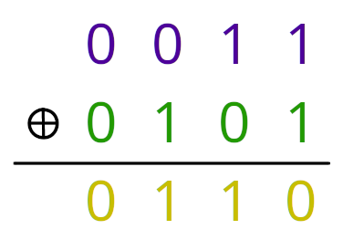
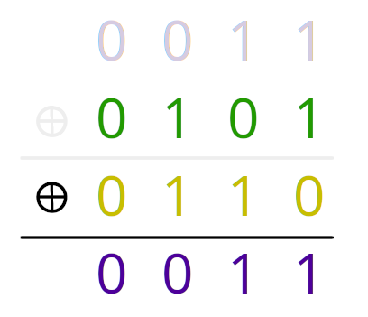

Getting from the Binary Operation XOR, to the Data Encryption Standard.

The motivation for this lesson is to bring an intuitive understanding of the inner workings and inspirations behind the Data Encryption Standard (DES).

The key component that drives all of this is a special property of an operation one can perform on binary numbers, 'exclusive or' (XOR). Given two binary values (1 or 0), XOR returns a 1 if both the two inputs are different and a 0 if they are the same. There are only four total ways to pair up 1 and 0 - here are the results of xor'ing each of those pairs (each vertical column, results in yellow):

Xor, symbolized by $\oplus$, is applied to each column to produce the bottom row. The columns which give a 1 and a 0 as input produce a 1, while the columns that give the same input produce a zero; this is simply how xor is defined. Note that the order does not matter, only whether or not the inputs are different or the same.

A special property of xor is revealed when we perform xor again, but this time xor'ing the green row with result of our previous example, the yellow row.

By xor'ing our previous result (yellow) with one of the inputs that led to it (green), we have gotten back the first input (purple). So the special property of xor is its *reversability*, in other words, we can take any result of a *xor* and *xor* it again with one of the inputs that led to it to produce *the other input* that led to it. To put it symbolically:

Purple $\oplus$ Green $=$ Yellow

Yellow $\oplus$ Green $=$ Purple

and even though its not pictured, you can check that:

Yellow $\oplus$ Purple $=$ Green

And how exactly is this useful for cryptohraphy? Well cryptographhy is all about 'public secrets,' encoded information which you don't want others to be able to understand but which yourself and other privelaged parties should be able to decode with some sort of password or knowledge about the encoding.

Now consider the examples above: Purple is your secret data, Green is the key ('key' here meaning 'password') you have chosen, and Yellow is your encoded information. If anyone were to see just Yellow on its own, it would not reveal anything about your secret data (Purple) and could be shared without worry. Only those with knowledge of Green would have the ability to *xor* it with Yellow and produce Purple, your actual, readable message. Nobody without knowledge of Green could recover Purple from Yellow, but if anyone else knew what Green was, they could xor it with Yellow to see the original data, Purple.

Of course this example is far too simple to be secure, any information this short could be easily guessed, but it shows how useful xor can be since it allows you to encrypt and decrypt information on the level of 1's and 0's with just a single method and serves as the building block for more complicated encryption schemes.

For longer data, this simple XOR method alone can be perfectly secure for encrypting larger data so long as your 'password' is sufficiently random, never re-used, and of course kept secret; this method is called a "one-time pad." This application of xor is the basic action of the Data Encryption Standard (DES) of 1970. With a few twists it can become much more secure and convenient, so the fundamental mechanism is well worth understanding.

So how do we get from the interesting property of xor to the famous Feistel Cypher that secures the Data Encryption Standard (DES)? 
